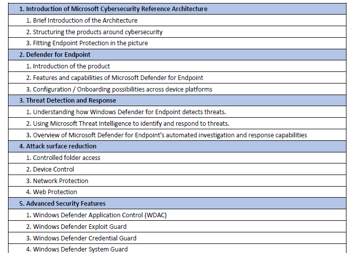

# Agenda & Timetable

## EduschoTschibo Proposal

## my Additions

Additional topics (unsorted)
a. Roles & Permissions
b. Troubleshooting (Onboarding, Sensor)
c. Device investigation
d. Evidence investigation
e. Vulnerability Management
f. Rules (Indicators, Alert suppression, …)
g. Security Baselines
h. MDE Security Enforcement
i. KQL Primer and useful queries
j. Defender for Cloud Apps Integration

## Timetable

### Monday - Morning

- What is MD XDR?
- What is MDE and why is it important?
- How differs MDE to Microsoft Intune?
  
- Introduction to MDE
  - Feature Overview
  - Licensing
  - Activating MDE
  - Overview MD XDR/MDE portal

### Monday - Afternoon

- Onboarding Devices
  - Windows 11
  - Windows Server
  - Linux Serer
  - Mac OS

### Tuesday - Morning

- Roles and Permissions
  - Classic
  - Modern
  
- Protection - How it works
  - Attack Surface Reduction
  - Network Protection
  - Device Control
  - Controlled Folder Access
  - Security Baselines
- Protection - How to configure
  - MDE security enforcement
  - Intune
  - PowerShell

### Tuesday - Afternoon

- Protection tbc

### Wednesday - Morning

- Advanced Security Features
  - Windows Defender Application Control
  - Windows Defender Exploit Guard
  - Windows Defender Credential Guard
  - Windows Defender System Guard

- Device Investigation

### Wednesday - Afternoon

- Device Actions
  - Package collection
  - App Restriction
  - Isolation
  - ...

### Thursday - Morning

- Alert/Incident Investigation
  - Alerts
  - Suppression Rules
  - Notification

- Vulnerability Management

### Thursday - Afternoon

- KQL Primer
  - Data Flow Pipeline
  - Basic Operators
  - Joins
  - MS Sentinel Integration

### Friday - Morning
