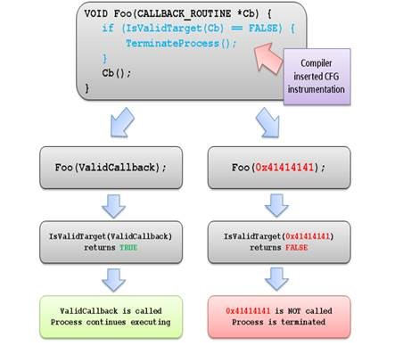

# References - Definitions - Explanation

This is a list of important definitions of some IT security expressions:

## Exploit protection mitigations

### Exploit

An exploit is a program, or piece of code, designed to find and take advantage of a security flaw or vulnerability in an application or computer system, typically for malicious purposes such as installing malware. An exploit is not malware itself, but rather it is a method used by cybercriminals to deliver malware. [Source](https://www.cisco.com/c/en/us/products/security/advanced-malware-protection/what-is-exploit.html#:~:text=An%20exploit%20is%20a%20program,by%20cybercriminals%20to%20deliver%20malware.)

### Control Flow Guard (CFG)

Control Flow Guard (CFG) is a highly-optimized platform security feature that was created to combat memory corruption vulnerabilities. By placing tight restrictions on where an application can execute code from, it makes it much harder for exploits to execute arbitrary code through vulnerabilities such as buffer overflows. [Source](https://learn.microsoft.com/en-us/windows/win32/secbp/control-flow-guard#what-is-control-flow-guard)

Software vulnerabilities are often exploited by providing unlikely, unusual, or extreme data to a running program. For example, an attacker can exploit a buffer overflow vulnerability by providing more input to a program than expected, thereby over-running the area reserved by the program to hold a response. This could corrupt adjacent memory that may hold a function pointer. When the program calls through this function it may then jump to an unintended location specified by the attacker. [Source](https://learn.microsoft.com/en-us/windows/win32/secbp/control-flow-guard#how-does-cfg-really-work)

### Data Execution Prevention (DEP)

It's a security feature found in modern operating systems designed to prevent code from being executed in certain regions of memory that are not intended to be executable.

1. **Memory Protection**: DEP helps protect your system by marking certain areas of memory as non-executable. This means that even if an attacker manages to inject malicious code into these areas, the code cannot be executed.
2. **Types of DEP**: There are two main types of DEP:
   - **Hardware-enforced DEP**: Utilizes the CPU to mark memory regions as non-executable.
   - **Software-enforced DEP**: Uses software to achieve similar protection, though it is generally less effective than hardware-enforced DEP.
3. **Implementation**: DEP is implemented in various operating systems, including Windows, Linux, and macOS, to enhance overall system security⁵.

By preventing the execution of code from non-executable memory regions, DEP helps mitigate the risk of certain types of attacks, such as buffer overflow attacks.

Source and more:
(1) DEP Abbreviation Meaning - [All Acronyms](https://www.allacronyms.com/DEP).
(2) DEP - What does DEP stand for? [The Free Dictionary](https://acronyms.thefreedictionary.com/DEP).
(3) Dep Definition & Meaning - [Merriam-Webster](https://www.merriam-webster.com/dictionary/dep).

### Address Space layout Randomization (ASLR)

ASLR stands for **Address Space Layout Randomization**. It's a security technique used in operating systems to protect against certain types of attacks, such as buffer overflow attacks. Here's how it works:

1. **Randomization**: ASLR randomly arranges the address space positions of key data areas of a process. This includes the base of the executable, the positions of libraries, the heap, and the stack.
2. **Protection**: By randomizing these memory addresses, it becomes much harder for an attacker to predict the location of specific functions or data structures, which is crucial for executing a successful attack.
3. **Implementation**: Most modern operating systems, including Windows, macOS, Linux, iOS, and Android, implement ASLR to enhance security²³.

In essence, ASLR adds an extra layer of defense, making it more challenging for attackers to exploit vulnerabilities in software.

Source:
(1) What Is ASLR, and How Does It Keep Your Computer Secure? - [How-To Geek](https://www.howtogeek.com/278056/what-is-aslr-and-how-does-it-keep-your-computer-secure/).
(2) What is ASLR? - [ReasonLabs](https://cyberpedia.reasonlabs.com/EN/aslr.html).
(3) What Does Aslr Mean? - Meaning, Uses and More - [FluentSlang](https://fluentslang.com/aslr-meaning/).
(4) ASLR Meaning: What Does ASLR Stand for? - [Love English](https://loveenglish.org/aslr-meaning/).

### Structured Exception Handler Overwrite Protection (SEHOP)

It's a security feature in Windows designed to prevent a specific type of attack known as an SEH overwrite attack. Here's a brief overview:

1. **Purpose**: SEHOP helps protect against exploits that target the Structured Exception Handler (SEH), which is a mechanism in Windows that handles exceptions or errors in software.
2. **How it Works**: During an SEH overwrite attack, an attacker tries to overwrite the SEH with malicious code. SEHOP prevents this by validating the SEH chain before executing any exception handling code. If the chain is found to be tampered with, the system terminates the application to prevent the exploit¹².
3. **Implementation**: SEHOP is enabled by default in modern versions of Windows, providing an additional layer of security against buffer overflow attacks and other similar exploits².

By ensuring the integrity of the SEH chain, SEHOP helps maintain the security and stability of applications running on Windows.

Source:
(1) [Understanding Structured Exception Handling Overwrite Protection (SEHOP)](https://www.calcomsoftware.com/understanding-sehop/).
(2) What is SEHOP? [Enhancing Cybersecurity with Advanced Memory Protection](https://cyberpedia.reasonlabs.com/EN/sehop.html).
(3) SEHOP Abbreviation Meaning - [All Acronyms](https://www.allacronyms.com/SEHOP.)

### Arbitrary Code Guard (ACG)

**Arbitrary Code Guard (ACG)** is a security feature introduced in Windows 10 to prevent [arbitrary code execution](#arbitrary-code-execution-ace). Here's a brief overview:

1. **Purpose**: ACG is designed to stop attackers from executing malicious code by preventing the creation and modification of code pages in memory.
2. **How it Works**: With ACG enabled, the Windows kernel enforces a policy where code pages are immutable. This means:
   - Existing code pages cannot be made writable.
   - Data segments cannot be turned into executable code³⁴.
3. **Application**: Although ACG was initially designed with Microsoft Edge in mind, it can be applied to most processes to enhance security³.

By ensuring that code pages remain immutable, ACG helps protect against various types of memory corruption attacks.

Source:
(1) The State of Exploit Development: Part 2 - [CrowdStrike](https://www.crowdstrike.com/blog/state-of-exploit-development-part-2/).
(2) ProcessDynamicCodePolicy: [Arbitrary Code Guard (ACG)](https://www.ired.team/offensive-security/defense-evasion/acg-arbitrary-code-guard-processdynamiccodepolicy).
(3) Exploit protection reference - [Microsoft Defender for Endpoint](https://learn.microsoft.com/en-us/defender-endpoint/exploit-protection-reference).
(4) Customize exploit protection - [Microsoft Defender for Endpoint](https://learn.microsoft.com/en-us/defender-endpoint/customize-exploit-protection).
(5) Arbitrary Code Guard vs. Kernel Code Injections - [CounterCraft](https://www.countercraftsec.com/blog/arbitrary-vs-kernel/).

### Arbitrary Code Execution (ACE)

Arbitrary Code Execution (ACE) is a type of security vulnerability that allows an attacker to execute any code of their choice on a target system. Here's a breakdown of how it works:

1. **Exploitation**: Attackers exploit vulnerabilities in software or hardware, such as buffer overflows, to inject malicious code into the system.
2. **Execution**: Once the malicious code is injected, the attacker can manipulate the system to execute this code, often with the same permissions as the compromised process¹².
3. **Impact**: This can lead to unauthorized actions like modifying data, installing malware, or escalating privileges to gain further control over the system².

In essence, ACE allows attackers to take control of a system and perform actions without the user's knowledge or consent, posing significant security risks.

Source:
(1) Arbitrary code execution - [Wikipedia](https://en.wikipedia.org/wiki/Arbitrary_code_execution).
(2) What is Arbitrary Code Execution? How It Works & Examples - [twingate](https://www.twingate.com/blog/glossary/arbitrary%20code%20execution).
(3) Arbitrary code execution definition – Glossary - [NordVPN](https://nordvpn.com/cybersecurity/glossary/arbitrary-code-execution/).

## Category B
