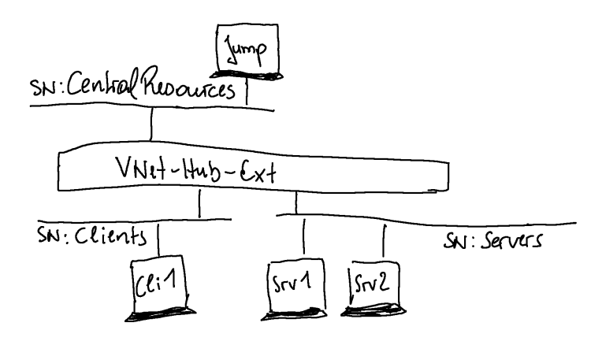

# Demo Environment for Azure VMs

---

## Purpose

These bicep modules are used to create a demo environment for Azure VMs. They could be used for VM, networking and security settings demo (JIT, AADLogin, ...)

## Notes

none

## How to use

```PowerShell
# Create the solution
New-AzResourceGroupDeployment -ResourceGroupName <your-RG-Name> -TemplateFile ./VMDemoEnv.bicep -DeployVNets $true -DeployVMs $true

# To get more clients or servers, change the default parameters in file .\modules\BaseVM.bicep
```

### Parameters

```bicep
param Prefix string = 'vmd'
param DeployVNets bool = false
param DeployVMs bool = false
```

## Overview



## Change log

| Date | Change |
| --- | --- |
| 04-06-2025 | created and successfully tested. |
| 05-06-2025 | NSG reference for Client VMs removed. |
